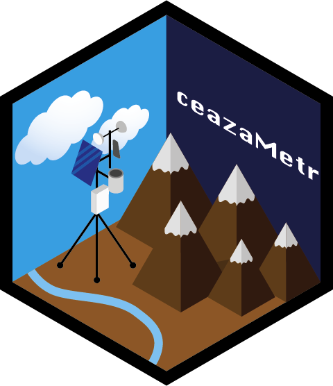

# ceazaMetr

## Description
 
`ceazaMetr` is an R package for using [CEAZA-Met](https://www.ceazamet.cl) Web Services for getting stations information, sensors metadata and the data of CEZA-Met meteorological network. The package is designed to work with the [CEAZA-Met API](https://www.ceazamet.cl/ws/pop_ws_doc.php), which provides access to the stations of the [Center for Advanced Studies in Arid Zones](http://www.ceaza.cl) (CEAZA) in Chile.


## Installation

You can install the development version from [GitHub](https://github.com/aldotapia/ceazaMetr) with:

```R
# install.packages("devtools")
devtools::install_github("aldotapia/ceazaMetr")
```

## Usage

There are 4 functions in this small package, which are:

- `getStationsList()`: Get the stations information of the CEAZA-Met network.
- `getSensorsList()`: Get the sensors codes and metadata of the CEAZA-Met network.
- `getSensorsData()`: Get the data serie of a specific sensor of the CEAZA-Met network.
- `et0()`: Calculate the reference evapotranspiration (ETo) using the FAO-56 Penman-Monteith method.

### Examples

```R
library(ceazaMetr)

getStationsList()
getSensorsList(e_cod = 6, user = "anon@host.com", tm_cod = "ta_c")
getSensorData(
  s_cod = "RPLTA", start_date = "2012-08-20",
  end_date = "2012-08-27", user = "anon@host.com"
)
et0(lat = -30, lon = -70, elev = 20,
    month = 1, t_max = 29.6, t_min = 22.8,
    rh_max = 90, rh_min = 70, ws_mean = 0.2,
    sr_mean = 200)
```

More examples in each function documentation.

### Call to inform

If you are going to use this package, please register sending an email to ceazamet@ceaza.cl, with: name, email, sector, organization, use that data will have, frequency and amount of data downloaded regularly.

Also, cite the source of the data in your work, for example:

 - *Data provided by CEAZA through the CEAZA-Met system*
 - *Datos provistos por CEAZA a traves del sistema CEAZA-Met*
